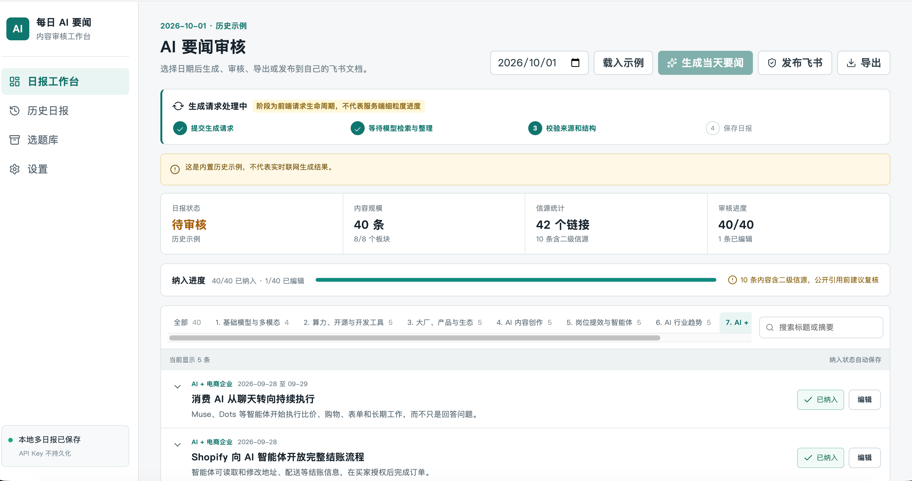

# 每日 AI 要闻工作台

> 把「每天刷 AI 新闻」变成一条可审核、可归档的流水线。
> 固定 8 个板块，每板块 5 条，共 40 条——用你自己的模型 API Key 生成，逐条人工审核后导出。

面向电商博主、企业内容与运营团队。它不是新闻聚合页，而是一个**带筛选规则和人工审核环节的日报生产工具**。

   



界面顶部右上角可以直接选择日期并生成当天要闻；左侧为板块与搜索筛选，中部为待审核的新闻列表，每条都可展开查看信源、纳入或排除、编辑内容。

---

## 目录

- [它能做什么](#它能做什么)
- [固定 8 个板块](#固定-8-个板块)
- [快速开始](#快速开始)
- [怎么用（4 步）](#怎么用4-步)
- [部署到线上](#部署到线上)
- [项目结构](#项目结构)
- [环境变量](#环境变量)
- [接口](#接口)
- [常见问题](#常见问题)
- [安全与隐私](#安全与隐私)
- [已知限制](#已知限制)

---

## 它能做什么

| 能力 | 说明 |
|---|---|
| 按日期生成日报 | 选择任意日期，调用你配置的模型生成当天要闻 |
| 固定板块结构 | 强制 8 个板块、每板块 5 条，避免输出散乱 |
| 信源校验 | 每条必须带可访问的 http(s) 来源链接，服务端会校验并清洗非法 URL |
| 自动去重 | 同一事件只保留一条 |
| 人工审核 | 逐条「纳入 / 排除」，可编辑标题、摘要、价值判断、实际意义 |
| 审核进度 | 实时显示已纳入、已编辑、含二级信源的数量 |
| 多日报归档 | 按日期保存，历史页可随时打开任一日期 |
| 导出 | 一键导出 Markdown / JSON |
| 飞书归档 | OAuth 授权后写入**你自己**的飞书文档（见[已知限制](#已知限制)） |
| 服务端持久化 | 日报存在服务器磁盘，**清空浏览器缓存、换浏览器都不会丢**；浏览器只保留一份缓存用于快速回显 |

**和普通 AI 摘要工具的区别**：生成只是中间产物。真正决定日报质量的是「人工审核」这一步——工具负责把 40 条候选摊开，你负责判断哪 35 条值得留下。

---

## 固定 8 个板块

| # | 板块 | 关注什么 |
|---|---|---|
| 1 | 基础模型与多模态 | 模型发布、能力升级、降价、重要评测 |
| 2 | 算力、开源与开发工具 | AI 芯片、云计算、开源模型、MCP、RAG、AI 编程 |
| 3 | 大厂、产品与生态 | OpenAI / Google / Anthropic / 字节 / 阿里 / 腾讯等产品动作 |
| 4 | AI 内容创作 | 图文视频音频、数字人、剪辑、配音、素材批量生产 |
| 5 | 岗位提效与智能体 | Agent、工作流自动化、知识库、各岗位落地 |
| 6 | AI 行业趋势 | 采用率、政策监管、资本、人才、产业格局 |
| 7 | AI + 电商企业 | 平台、零售、广告投放、选品、客服、履约供应链 |
| 8 | AI + 商业 | 商业模式、融资并购、各行业经营结果 |

生成优先级：**先取最近 24 小时；某板块不足 5 条时，该板块扩展到最近 72 小时，并标注真实发布日期**。72 小时仍不足时如实保留缺口，不用传闻凑数。

---

## 快速开始

### 环境要求

- **Node.js 20 或更高**（依赖内置 `fetch`、`node:test`）

### 最简方式：一键启动（推荐给非技术用户）

下载仓库后，双击对应文件：

| 系统 | 文件 |
|---|---|
| macOS | `start-workbench.command` |
| Windows | `start-workbench.bat` |

脚本会自动完成：检查 Node 版本 → 安装依赖 → 构建前端 → 启动服务 → 打开浏览器。

> **macOS 首次双击**可能提示「无法验证开发者」，在文件上**右键 → 打开**，再确认一次即可。
> 两个脚本都会先检测 Node.js，没装会提示到 [nodejs.org](https://nodejs.org/) 下载。
> Windows 用户需要已安装 Node.js；脚本本身不需要额外配置。

### 本机运行（手动方式）

```bash
git clone https://github.com/a18774388810-hue/daily-ai-news-workbench.git
cd daily-ai-news-workbench
npm install
npm run dev
```

打开 **http://localhost:5173** 即可（开发模式访问 5173，不是 8787）。

`npm run dev` 会同时启动：

- Node 接口服务：`http://localhost:8787`
- Vite 开发服务器：`http://localhost:5173` ← **浏览器访问这个**

Vite 会把 `/api` 请求代理到 Node。也可以分开跑：

```bash
npm run dev:server   # 只跑接口
npm run dev:client   # 只跑前端
```

### 生产模式

```bash
npm run build   # 构建前端到 dist/
npm start       # 启动 Node 服务并托管 dist/
```

打开 **http://localhost:8787**。

生产模式由 Node 同时提供接口和前端页面，只有一个端口；开发模式是前后端分开两个端口。

改端口：`PORT=3000 npm start`

### Docker

```bash
docker build -t ai-news-workbench .
docker run -d -p 8787:8787 \
  -v ai-news-data:/app/data \
  ai-news-workbench
```

> `-v ai-news-data:/app/data` 是**必须的**：日报保存在这个卷里，不挂卷的话容器重建数据就没了。

---

## 怎么用（4 步）

**第 1 步：配置模型**

进入左侧「设置」，填写：

| 字段 | 说明 |
|---|---|
| Endpoint | OpenAI 兼容的 `chat/completions` 地址，例如 `https://api.openai.com/v1/chat/completions` |
| Model | 模型名，例如 `gpt-4o`、`claude-sonnet-4`，或你所用中转平台的模型 ID |
| API Key | **你自己的** Key，只存在当前页面内存 |
| 联网搜索 | 若你的服务支持 `tools: [{type:"web_search"}]` 才勾选 |

**第 2 步：生成**

回到「日报工作台」→ 选日期 → 点「生成当天要闻」。

生成按板块分成 8 次请求（并发 2 路），每个板块最长等待 120 秒，因此**整份日报通常需要几分钟**。期间不要刷新或关闭页面。某个板块失败不影响其他板块，会以警告形式提示。

**第 3 步：审核**

- 点标题左侧箭头展开，查看摘要、价值判断、对企业/博主的意义和原始信源
- 「已纳入 / 已排除」逐条筛选
- 点「编辑」修改标题和正文，改动自动保存
- 顶部显示审核进度和二级信源提醒

**第 4 步：导出或归档**

- 「导出」→ 下载 Markdown 或 JSON
- 「发布飞书」→ 授权后写入你自己的飞书文档（当前状态见[已知限制](#已知限制)）

> 想先看效果？点顶部的「载入示例」，会加载内置的 `2026-10-01` 八板块 40 条真实日报——那是预置历史数据，不是实时生成。

---

## 部署到线上

这个项目**不是纯静态站点**：生成接口、密钥转发和飞书 OAuth 都需要 Node 进程。所以：

| 平台 | 是否可用 | 说明 |
|---|---|---|
| 本机 / VPS | ✅ | `npm run build && npm start`，前面挂 Nginx |
| Docker（任意容器平台） | ✅ | 用仓库自带 `Dockerfile` |
| Railway / Render / Fly.io / Zeabur | ✅ | 构建命令 `npm install && npm run build`，启动命令 `npm start` |
| Vercel / Netlify | ⚠️ | 需把 `server/` 改写成 Serverless Function，当前代码不能直接跑 |
| GitHub Pages / 对象存储 | ❌ | 纯静态托管，没有后端 |

**Docker 部署示例**

```bash
docker build -t ai-news-workbench .
docker run -d -p 8787:8787 \
  -e PORT=8787 \
  -e PUBLIC_BASE_URL=https://你的域名 \
  ai-news-workbench
```

生产部署务必：

1. 启用 **HTTPS**（API Key 会经过服务器）
2. 在反向代理层加**请求频率限制**（当前代码未内置限流）
3. 只运行**单个实例**（会话存内存，多实例会导致飞书授权状态丢失）

---

## 项目结构

```text
.
├── src/                        前端（React + TypeScript）
│   ├── App.tsx                 页面与全部交互逻辑
│   ├── styles.css              样式
│   ├── types.ts                类型定义
│   └── data/
│       ├── parser.ts           内置示例数据解析、8 板块常量
│       └── report-2026-10-01.md  内置的 2026-10-01 示例日报（历史种子）
│
├── server/                     后端（Node 原生 http，无框架）
│   ├── index.js                启动入口，读取 PORT
│   ├── app.js                  路由 + 静态文件托管
│   ├── generate.js             调用模型、按板块分批请求、endpoint 安全校验
│   ├── report-validator.js     8 板块校验、字段校验、URL 白名单、去重
│   ├── store.js                日报持久化：按匿名分区读写磁盘、原子写入、结构校验
│   └── feishu.js               飞书 OAuth 与文档写入适配
│
├── test/                       测试（node:test）
│   ├── health.test.js          健康检查
│   ├── store.test.js           持久化：校验、读写、分区隔离、Cookie
│   └── report-validator.test.js 解析、去重、板块与 URL 校验、endpoint 安全
│
├── data/                       运行时生成的日报数据（已 gitignore，不入库）
│
├── scripts/dev.js              同时启动前后端的开发脚本
│
├── start-workbench.command     一键启动（macOS / Linux）
├── start-workbench.bat         一键启动（Windows）
│
├── docs/
│   └── screenshot-workbench.png  界面截图
│
├── SKILL.md                    原始 Skill 规则：板块定义、评分标准、筛选原则
├── references/api_reference.md 板块分类与信源参考
│
├── Dockerfile                  容器构建
├── vite.config.ts              Vite 配置（含 /api 代理）
└── README.md                   本文档
```

**两个目录的关系**：`SKILL.md` 是这套工具的「方法论」——它定义了每个板块收什么、什么新闻该排除、怎么评分。`src/` + `server/` 是「实现」。想改筛选标准，改 `SKILL.md` 和 `server/generate.js` 里的提示词即可。

---

## 环境变量

| 变量 | 默认 | 说明 |
|---|---|---|
| `PORT` | `8787` | 服务端口 |
| `NODE_ENV` | — | 设为 `production` 后，endpoint 仅允许 HTTPS 且拦截私网地址 |
| `DATA_DIR` | `<项目目录>/data` | 日报持久化目录。部署到云平台时，把它指向**挂载的持久卷**，否则重启后数据会随容器重置 |
| `FEISHU_APP_ID` | 空 | 飞书应用 App ID，不填则飞书登录按钮显示配置说明 |
| `FEISHU_APP_SECRET` | 空 | 飞书应用 App Secret |
| `PUBLIC_BASE_URL` | `http://localhost:8787` | 对外访问地址，用于拼接 OAuth 回调 |

**模型 API Key 不是环境变量**，由每个用户在网页上填写，且不落盘。

> ⚠️ **部署提醒**：Railway / Render / Fly.io 这类平台的免费容器默认**没有持久磁盘**，容器重启会清空文件系统。要保证日报长期保存，需要在平台上挂一个 Volume，并把 `DATA_DIR` 指向该挂载点。不挂卷的话，重启后数据会回到内置示例状态。

---

## 接口

| 方法 | 路径 | 说明 |
|---|---|---|
| `GET` | `/api/health` | 健康检查，返回 `{"ok":true}` |
| `GET` | `/api/state` | 读取该浏览器分区的全部日报 |
| `PUT` | `/api/state` | 保存全部日报（结构校验 + 原子写入磁盘） |
| `POST` | `/api/generate` | 生成日报，Key 通过请求头传入 |
| `GET` | `/api/feishu/status` | 飞书配置与授权状态（不返回令牌） |
| `GET` | `/api/feishu/login` | 发起飞书 OAuth |
| `GET` | `/api/feishu/callback` | OAuth 回调，校验 state 并换取令牌 |
| `POST` | `/api/feishu/publish` | 写入用户飞书文档 |

**生成请求示例**

```http
POST /api/generate
content-type: application/json
x-user-api-key: <你自己的 key>

{
  "date": "2026-10-03",
  "endpoint": "https://api.openai.com/v1/chat/completions",
  "model": "gpt-4o",
  "enableWebSearch": false
}
```

服务端限制：请求体 ≤ 1 MB、上游响应 ≤ 2 MB、单板块上游超时 120 秒、endpoint 协议与私网校验、来源 URL 协议白名单、错误信息自动截断并清洗 Key。

---

## 常见问题

**下载源码后，能不能不装 Node 直接用？**

不能。这是一个前后端一体的应用：前端负责界面，后端负责调用模型、校验信源和转发你的 Key。后端必须跑在一个 Node 进程里，所以本机运行需要安装 Node.js 20+。

如果你只想「打开网页就能用」，需要把它部署到支持 Node 的服务器（见[部署到线上](#部署到线上)），或者使用别人已经部署好的地址。

**需要在哪几个地方填东西？**

不是只填 API Key。设置页有**三项**：

1. **Endpoint** —— OpenAI 兼容的接口地址
2. **Model** —— 模型名
3. **API Key** —— 你自己的 Key

三项必须属于**同一个服务商**。拿 A 平台的 Key 去请求 B 平台的地址一定失败。

**生成的新闻是空的，或者提示无法检索**

说明你的模型没有联网能力。工作台要求每条新闻都带**可验证的真实链接**，模型拿不到实时信息时会返回空结果，而不是编造新闻。解决办法：

1. 换一个支持联网搜索的模型；或
2. 勾选「联网搜索」开关（仅当你所用服务支持 `web_search` 工具）；或
3. 在服务端加一层独立的搜索服务，把检索结果喂给模型——这是更彻底的方案。

**报错 `Web Search cannot be used with JSON mode`**

部分中转平台不允许 `web_search` 与 `response_format: json_object` 同时使用。本项目已处理：勾选联网搜索时自动关闭 JSON Mode，改由提示词要求 JSON、服务端再解析校验。

**生成到一半失败 / 页面提示无法连接服务**

生成是 8 次分批请求，中途如果 Node 服务退出，浏览器会断连。确认 `npm start` 的进程仍在运行，且页面没有刷新。

**能不能用中转平台（如各种 API 代理站）的 Key？**

可以，只要它兼容 OpenAI 的 `chat/completions` 协议。把 Endpoint 换成该平台的地址即可。注意**Key 和 Endpoint 必须属于同一平台**，用 A 平台的 Key 请求 B 平台的地址会失败。

**数据存在哪？换电脑会丢吗？**

日报、编辑状态和发布标记都存在**服务端**（`data/state/` 目录，按浏览器匿名分区存放），浏览器里只留一份缓存用于打开页面时立即回显。

所以：**清空浏览器缓存、换浏览器、换电脑都不会丢**——只要还是访问同一个服务地址，数据就还在。

需要注意两点：

1. 服务端用 Cookie 记住你是哪个分区。如果**连 Cookie 也一起清掉**，服务端会把你当成新访客，之前的数据不会自动出现（文件还在服务器上，但没有入口）。
2. 部署到云平台且**没有挂持久卷**时，容器重启会清空磁盘。见[环境变量](#环境变量)里的部署提醒。

长期保存建议仍然定期用「导出」下载 Markdown/JSON。

---

## 安全与隐私

**API Key 的处理**

- 只在当前页面内存中保存，**不写 localStorage、不写数据库、不进服务端日志**
- 刷新或关闭页面即清除
- 随单次请求经服务端转发到你填写的 endpoint
- **服务端的运营者仍可在网络层看到请求**——因此只应使用你自己信任的服务器、启用 HTTPS，并使用可随时撤销的低权限 Key

**endpoint 安全**

服务端会拦截指向本机、内网（`10.x`、`172.16-31.x`、`192.168.x`）和云元数据（`169.254.169.254`）的地址，避免被用作 SSRF 跳板。开发环境（未设 `NODE_ENV=production`）仅放行 `localhost` 的 HTTP 地址，便于连接本地模型服务（如 Ollama）。

**飞书授权**

access token、refresh token 和目标文档 token 只保存在 Node 进程内存会话中，服务重启即失效。本项目**不包含任何预置的私有文档地址或令牌**。

**日报数据**

- 保存在服务端 `DATA_DIR`（默认 `data/state/`），已加入 `.gitignore`，**不会被提交到仓库**
- 按浏览器匿名分区隔离：每个人只能看到自己那份，彼此不可见
- 分区标识是服务端下发的随机 Cookie，不关联任何账号身份
- 公开部署时，日报内容本身不是敏感信息，但**不要把 `DATA_DIR` 暴露为可公开访问的静态目录**

---

## 已知限制

- **飞书正文写入尚未完成**：OAuth 登录、目标文档选择和新建文档流程已实现，但 docx 内容写入的最终 API 字段未在真实飞书应用中验证，`POST /api/feishu/publish` 会明确返回 `501 FEISHU_WRITE_ADAPTER_PENDING`，**不会伪装成功**。补全位置在 `server/feishu.js`。
- **无账号体系**：日报存在服务端并按浏览器匿名分区隔离，但没有账号登录。清掉 Cookie 后，服务端会把你当成新访客，旧数据仍在服务器上但不会自动出现。
- **无内置限流**：公网部署请在反向代理层加频率限制。
- **单实例**：日报存在本地磁盘，飞书会话存在内存，不适合多实例水平扩展；多实例需要共享存储。
- **生成耗时长**：8 个板块分批请求，整份日报通常需要几分钟。
- **示例数据只到 2026-10-01**：其余日期必须实际生成后才会出现在历史列表，不会用占位内容填充。

---

## License

MIT License，详见 [LICENSE](./LICENSE)。
